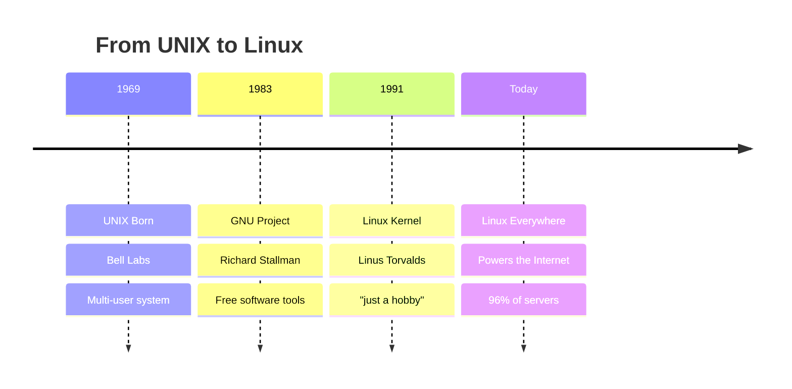
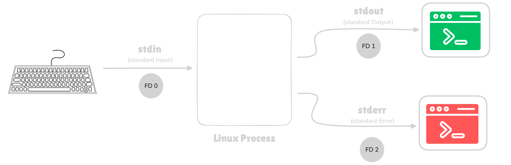

# Linux Essentials

## Part 1: Foundations
## Part 2: Linux Fundamentals
## Part 3: Permissions & I/O
## Part 4: Shell Scripting

<!-- end_slide -->


# What is Linux? 

<!-- pause -->

**Is Linux an Operating System** - like Windows or macOS ???

<!-- pause -->

More accurately:

<!-- incremental_lists: true -->

* **Linux** = The kernel (core of the OS)
* **GNU/Linux** = Complete operating system
* **Linux Distributions** = Packaged versions (Ubuntu, Fedora, etc.)

<!-- end_slide -->

**Understanding Kernel & OS** 

# What is a Kernel? 

<!-- pause -->

**The Kernel = The Core of the Operating System**

<!-- pause -->

**What it does:**

<!-- incremental_lists: true -->

* Manages hardware (CPU, RAM, disk)
* Controls processes (which programs run)
* Handles memory allocation
* Manages file systems
* Provides security & permissions

<!-- pause -->
<!-- end_slide -->

# What is an Operating System? 

<!-- pause -->

**Operating System = Complete System**

Kernel + Shell + Utilities + Applications

<!-- pause -->

```text
┌──────────────────────────────┐
│  Applications (User Space)   │  ← Firefox, games, etc.
├──────────────────────────────┤
│  Shell & Utilities           │  ← bash, ls, cp, mv
├──────────────────────────────┤
│  Kernel                      │  ← Linux kernel
├──────────────────────────────┤
│  Hardware                    │  ← CPU, RAM, Disk
└──────────────────────────────┘
```

<!-- end_slide -->

**Components:**
* **Kernel** - Core system management
* **System utilities** - Basic commands and tools
* **Shell** - Command interpreter
* **Desktop Environment** - Graphical interface (optional)
* **Applications** - Programs you use

<!-- end_slide -->

# Kernel vs Operating System

<!-- pause -->

**Kernel** = Just the core
* Linux is technically just a kernel
* ~30 million lines of code
* Created by Linus Torvalds

<!-- pause -->

**Operating System** = Everything
* Linux kernel + GNU tools + Desktop + Apps
* Called "Linux" but technically "GNU/Linux"
* Different "distributions" package it differently

<!-- pause -->

<!-- end_slide -->

# Why Linux? 

<!-- pause -->

<!-- column_layout: [1, 1] -->

<!-- column: 0 -->

## **Free & Open**
* No licensing costs
* Source code available
* Modify anything
* No vendor lock-in

## **Secure**
* Open source = peer reviewed
* Fast security patches
* Less malware
* Better permissions

<!-- column: 1 -->

##  **Powerful**
* Runs for years without reboot
* Efficient resources
* Scales to any size

##  **Dominant**
* 96% of web servers
* 100% of supercomputers
* Billions of Android phones
* All major cloud platforms

<!-- reset_layout -->

<!-- speaker_note:
Windows/Mac are proprietary and expensive
Linux is free and customizable
Most of the internet runs on Linux
If you use the internet, you use Linux!
-->

<!-- end_slide -->

# Why Linux as Students? 

<!-- pause -->

**Perfect for Learning:**

<!-- incremental_lists: true -->

1. **Free** - No cost for software
2. **Learn How Computers Work** - See inside the system
3. **Industry Standard** - Used in most tech companies
4. **Career Skills** - Linux knowledge = job opportunities
5. **Development** - Best environment for programming
6. **Customizable** - Make it yours

<!-- pause -->

**What You Can Do:**

<!-- column_layout: [1, 1] -->

<!-- column: 0 -->

* Web development
* Python/Java/C++ programming
* Data science & ML
* Cybersecurity
* DevOps & Cloud

<!-- column: 1 -->

* Server management
* Docker & containers
* Git version control
* Database management
* Networking

<!-- reset_layout -->

<!-- speaker_note:
Linux is essential for CS/IT students
Most developer tools are built for Linux first
Learning Linux = learning how software really works
Companies hire Linux-skilled developers
Free means experiment without limits
-->

<!-- end_slide -->

<!-- jump_to_middle -->

# History of Linux 

<!-- end_slide -->

# The Evolution 



<!-- speaker_note:
Quick history - 30 years of evolution
Each step solved a real problem
UNIX was expensive → GNU made free tools
GNU needed kernel → Linus made Linux
Together = revolution
-->

<!-- end_slide -->

# 1969: UNIX 

<!-- column_layout: [1, 1] -->

<!-- column: 0 -->

**The Innovation:**
* Multi-user system
* Multi-tasking
* Written in C (portable!)
* Hierarchical file system

<!-- column: 1 -->

**The Problem:**
* Proprietary
* Very expensive
* Closed source
* Universities couldn't afford it

<!-- reset_layout -->

<!-- pause -->

<!-- end_slide -->

# 1983: GNU Project 

<!-- pause -->

**Richard Stallman's Mission:**
* Create a free UNIX-like system
* GNU = "GNU's Not Unix"

<!-- pause -->

<!-- column_layout: [1, 1] -->

<!-- column: 0 -->

**What GNU Built:**
* GCC compiler
* bash shell
* Core tools (ls, cp, mv)
* Text editor (emacs)

<!-- column: 1 -->

**What Was Missing:**
* **The Kernel**

<!-- reset_layout -->

<!-- end_slide -->

# 1991: Linux is Born! 

**August 25, 1991 - Linus Torvalds:**

> "I'm doing a (free) operating system (just a hobby, won't be big and professional like GNU)"

<!-- pause -->

<!-- pause -->
* Linux provided the kernel
* GNU provided everything else
* Together = Full operating system

<!-- speaker_note:
Most famous understatement in computing!
Linux + GNU = GNU/Linux (but we say "Linux")
Now runs the world
-->

<!-- end_slide -->

# How WSL Makes Linux Work on Windows

<!-- pause -->

**Traditional Approach:**
* Dual boot (separate partitions)
* Virtual Machine (VMware, VirtualBox)
* Slow and resource heavy

<!-- pause -->

**WSL Approach - Better!**

<!-- pause -->

**WSL Magic:**
* Runs real Linux kernel inside Windows
* Fast (uses lightweight virtualization)
* Shares files between Windows & Linux
* No reboot needed!

<!-- speaker_note:
WSL 2 runs actual Linux kernel via Hyper-V
Not emulation - real Linux system
Best of both worlds: Windows GUI + Linux power
Perfect for students who need both
-->

<!-- end_slide -->

# WSL Setup 


# What is WSL?

<!-- pause -->

**WSL = Windows Subsystem for Linux**

<!-- pause -->

**What WSL Does:**
* Runs a real Linux kernel on Windows
* Access Linux command line & tools
* No dual boot or VM needed
* Direct file system integration

<!-- pause -->

**Two Versions:**
* **WSL 1:** Translation layer (faster file access)
* **WSL 2:** Real Linux kernel (better compatibility)  Recommended

<!-- speaker_note:
WSL lets Windows users run Linux natively
Perfect for developers who need both systems
WSL 2 uses actual Linux kernel via virtualization
Can run Docker, compile code, use Linux tools
Files accessible from both Windows and Linux
-->

<!-- end_slide -->

# Setting Up WSL 2

<!-- pause -->

## Method 1: Automatic Setup  (Recommended)

**One Command (PowerShell as Admin):**

```powershell
wsl --install
```

<!-- pause -->

**What This Does:**
<!-- incremental_lists: true -->
1. Enables WSL feature
2. Enables Virtual Machine Platform
3. Installs latest Linux kernel
4. Installs Ubuntu by default
5. Restarts your computer

<!-- pause -->

## After Restart:
<!-- incremental_lists: true -->
1. Ubuntu will auto-launch
2. Create your Linux username
3. Set your password
4. You're in Linux! 

<!-- speaker_note:
Method 1 works on Windows 10 (version 2004+) and Windows 11
This is the easiest and recommended method
After restart, Ubuntu terminal opens automatically
Username/password are for Linux only (separate from Windows)
-->

<!-- end_slide -->


<!-- pause -->

## Step 5: Set WSL 2 as Default

**Run in PowerShell (Admin):**

```powershell
wsl --set-default-version 2
```

<!-- pause -->

## Step 6: Install Linux Distribution

```powershell
# Install Ubuntu (recommended for beginners)
wsl --install -d Ubuntu

# Or choose another:
wsl --list --online    # See all available distros
wsl --install -d Debian
wsl --install -d Kali-Linux
```

<!-- pause -->

## Step 7: Launch & Setup

* Start menu → "Ubuntu"
* Create username and password
* Done! 

<!-- speaker_note:
After kernel update, WSL 2 becomes default for new installs
Choose Ubuntu if unsure - most popular and beginner-friendly
First launch will take a minute to set up
Username can be different from Windows username
-->

<!-- end_slide -->

# Terminal vs Shell

<!-- pause -->

**Terminal** = The window (app you see)
* GNOME Terminal, iTerm2, Windows Terminal
* Just displays input/output

<!-- pause -->

**Shell** = The interpreter (runs inside terminal)
* bash, zsh, fish
* Translates your commands for the kernel


# Let's Dive In! 

<!-- pause -->

**Next Up:**
* Navigate the file system
* Learn essential commands

<!-- end_slide -->


# Linux Fundamentals
```
   __    _                    ____            _          
  / /   (_)___  __  ___  __  / __ )____ ______(_)_________
 / /   / / __ \/ / / / |/_/ / __  / __ `/ ___/ / ___/ ___/
/ /___/ / / / / /_/ />  <  / /_/ / /_/ (__  ) / /__(__  ) 
\____/_/_/ /_/\__,_/_/|_| /_____/\__,_/____/_/\___/____/  
```

**What we'll cover:**
* Understanding the Linux filesystem
* Navigating directories
* Working with files and directories
* Viewing file content
* System and user information
* Command-line tips and best practices

<!-- end_slide -->

# Part 1: Understanding the Filesystem

## The Linux Directory Structure

**Unlike Windows (C:\, D:\), Linux has ONE tree:**

```
/                    (root - the top of everything)
├── home/            (user home directories)
│   └── abhimanyu/      (your personal files)
├── etc/             (configuration files)
├── var/             (variable data - logs, caches)
├── usr/             (user programs and libraries)
├── tmp/             (temporary files)
├── bin/             (essential command binaries)
├── sbin/            (system binaries)
└── opt/             (optional software)
```

**Key Concepts:**
* `/` is the root (not a drive letter)
* Paths use forward slashes `/` (not backslashes)
* Hidden files start with `.` (like `.bashrc`)
* Case-sensitive: `File.txt` ≠ `file.txt`

<!-- end_slide -->

## Home Directory

**Your personal space: `/home/username`**

**Shortcuts:**
* `~` → Your home directory
* `~abhimanyu` → abhimanyu's home directory
* `.` → Current directory
* `..` → Parent directory
* `-` → Previous directory

```bash +exec
# These are all the same (if you're the user)
echo "Home: $HOME"
echo "Tilde: ~"
echo "PWD: $(pwd)"
```

**Common paths you'll use:**
* `~/Documents` → Your documents
* `~/Downloads` → Downloaded files
* `~/Desktop` → Desktop items
* `~/.config` → Application configs (hidden)

<!-- end_slide -->

# Part 2: Navigation Commands

## pwd - Print Working Directory

**Where am I right now?**

```bash +exec
pwd
```

**What it shows:**
* Full absolute path from root `/`
* Your current location in the filesystem

**When to use:**
* When you're lost in the terminal
* Before running potentially dangerous commands
* In scripts to verify location

**Pro tip:** Most terminals show this in the prompt!
```
abhimanyu@system:~/projects/website$
              ^^^^^^^^^^^^^^^^
              This is your pwd
```

<!-- end_slide -->

## ls - List Directory Contents

**The most-used Linux command!**

**Basic usage:**
```bash +exec
# List files in current directory
ls

# List with details
ls -l

# List all files (including hidden)
ls -a

# Human-readable sizes
ls -lh

# Sort by modification time (newest first)
ls -lt
```

**Combine options:**
```bash +exec
# Common combination: all files, detailed, human-readable
ls -lah
```

<!-- end_slide -->

## Understanding ls -l Output

**Let's decode the output:**

```
-rw-r--r-- 1 abhimanyu abhimanyu 4096 Jan 28 10:30 document.txt
│││││││││  │ │      │      │    │          │
│││││││││  │ │      │      │    │          └─ Filename
│││││││││  │ │      │      │    └─ Modification time
│││││││││  │ │      │      └─ Size in bytes
│││││││││  │ │      └─ Group owner
│││││││││  │ └─ User owner
│││││││││  └─ Number of links
│││││││││
││││││││└─ Others: execute (x)
│││││││└── Others: write (w)
││││││└─── Others: read (r)
│││││└──── Group: execute
││││└───── Group: write
│││└────── Group: read
││└─────── Owner: execute
│└──────── Owner: write
└───────── Owner: read (or file type)
```

**File type indicators:**
* `-` → Regular file
* `d` → Directory
* `l` → Symbolic link

<!-- end_slide -->

## ls - More Useful Options

**Sorting and filtering:**

```bash +exec
# Sort by size (largest first)
ls -lS

# Reverse order
ls -lr

# Sort by extension
ls -lX

# Only show directories
ls -d */

# Recursive listing (show subdirectories)
ls -R

# One file per line
ls -1
```

**Pro tip - Aliases:**
```bash
# Many systems have these by default
ll    # alias for 'ls -l'
la    # alias for 'ls -la'
```

<!-- end_slide -->

## cd - Change Directory

**Navigate the filesystem:**

```bash
# Go to home directory
cd
cd ~

# Go to specific directory
cd /var/log

# Go up one level
cd ..

# Go up two levels
cd ../..

# Go to previous directory
cd -

# Relative path (from current location)
cd Documents/projects

# Absolute path (from root)
cd /home/abhimanyu/Documents
```

**Tab completion is your friend!**
* Type `cd Doc` and press TAB
* Shell completes to `cd Documents/`

<!-- end_slide -->

## cd - Practical Examples

```bash +exec
#!/bin/bash

echo "=== Navigation Demo ==="

# Show current location
echo "Starting at: $(pwd)"

# Create demo structure
mkdir -p demo/projects/website
mkdir -p demo/documents

# Navigate around
cd demo
echo "Now in: $(pwd)"

cd projects/website
echo "Now in: $(pwd)"

cd ../..
echo "Back to: $(pwd)"

# Clean up
cd ..
rm -rf demo
```

**Common mistakes:**
* ❌ `cd ..` (space required!)
* ❌ `cd/home` (space required!)
* ✅ `cd ..` (correct)
* ✅ `cd /home` (correct)

<!-- end_slide -->

# Part 3: Working with Files

## Creating Files and Directories

**mkdir - Make directories:**

```bash +exec
# Create single directory
mkdir my_project

# Create multiple directories
mkdir dir1 dir2 dir3

# Create nested directories
mkdir -p projects/web/css

# Create with specific permissions
mkdir -m 755 public_folder

# Verbose output
mkdir -v new_folder

# Cleanup
rm -rf my_project dir1 dir2 dir3 projects public_folder new_folder
```

**touch - Create empty files:**

```bash +exec
# Create new file
touch newfile.txt

# Create multiple files
touch file1.txt file2.txt file3.txt

# Update timestamp of existing file
touch existing_file.txt

# Cleanup
rm -f newfile.txt file1.txt file2.txt file3.txt
```

<!-- end_slide -->

## cp - Copy Files and Directories

**Basic copying:**

```bash +exec
#!/bin/bash

# Create demo file
echo "Hello Linux!" > original.txt

# Copy file
cp original.txt backup.txt

# Copy with verbose output
cp -v original.txt another_copy.txt

# Copy multiple files to directory
mkdir backup_dir
cp original.txt backup.txt backup_dir/

# Show results
echo "Files created:"
ls -l *.txt backup_dir/

# Cleanup
rm -rf original.txt backup.txt another_copy.txt backup_dir
```

<!-- end_slide -->

## cp - Advanced Options

**Copying directories and preserving attributes:**

```bash +exec
#!/bin/bash

# Create demo structure
mkdir -p source/subdir
echo "File 1" > source/file1.txt
echo "File 2" > source/subdir/file2.txt

# Copy directory recursively
cp -r source destination

# Copy and preserve attributes (permissions, timestamps)
cp -rp source destination_preserve

# Interactive copy (ask before overwrite)
# cp -i file.txt existing.txt

# Force copy (overwrite without asking)
cp -f source/file1.txt destination/

# Show results
echo "Directory structure:"
ls -R destination

# Cleanup
rm -rf source destination destination_preserve
```

<!-- end_slide -->

## mv - Move and Rename

**Move files/directories:**

```bash +exec
#!/bin/bash

# Create demo files
mkdir demo_mv
cd demo_mv

touch oldname.txt
echo "Content" > file.txt
mkdir old_dir

# Rename file
mv oldname.txt newname.txt

# Move file to directory
mkdir destination
mv file.txt destination/

# Rename directory
mv old_dir new_dir

# Move multiple files
touch a.txt b.txt c.txt
mv a.txt b.txt c.txt destination/

echo "Final structure:"
ls -R

# Cleanup
cd ..
rm -rf demo_mv
```

**Remember:** `mv` does NOT copy - it moves!

<!-- end_slide -->

## rm - Remove Files and Directories

**⚠️ DANGER: No trash bin in Linux! Deletions are permanent!**

```bash +exec
#!/bin/bash

# Create test files
touch test1.txt test2.txt
mkdir test_dir
touch test_dir/file.txt

# Remove file
rm test1.txt

# Remove multiple files
touch temp1 temp2 temp3
rm temp1 temp2 temp3

# Remove directory (must be empty)
mkdir empty_dir
rmdir empty_dir

# Remove directory and contents (DANGEROUS!)
rm -r test_dir

# Force remove without prompting
touch unwanted.txt
rm -f unwanted.txt

# Interactive mode (asks before each deletion)
# rm -i file.txt

# Cleanup
rm -f test2.txt
```

**Safety tips:**
* Use `rm -i` for important deletions
* Double-check with `ls` before `rm -rf`
* Never run `rm -rf /` or `rm -rf /*`

<!-- end_slide -->

# Part 4: Viewing File Contents

## cat - Concatenate and Display

**View entire file:**

```bash +exec
#!/bin/bash

# Create demo file
cat > demo.txt << 'EOF'
Line 1: Introduction to Linux
Line 2: Learning commands
Line 3: Practicing daily
Line 4: Becoming proficient
Line 5: Mastering the terminal
EOF

# Display file
echo "=== File Contents ==="
cat demo.txt

# Display with line numbers
echo -e "\n=== With Line Numbers ==="
cat -n demo.txt

# Display multiple files
echo "Content 1" > file1.txt
echo "Content 2" > file2.txt
echo -e "\n=== Multiple Files ==="
cat file1.txt file2.txt

# Cleanup
rm -f demo.txt file1.txt file2.txt
```

<!-- end_slide -->

## cat - Creating Files

**Quick way to create files:**

```bash
# Method 1: Simple redirect
cat > newfile.txt
Type your content here
Press Ctrl+D when done

# Method 2: Here document
cat > script.sh << 'EOF'
#!/bin/bash
echo "Hello World"
EOF

# Method 3: Append to file
cat >> existing.txt << 'EOF'
This line will be added
to the end of the file
EOF
```

**Pro tip:** For long files, use `less` or `more` instead of `cat`

<!-- end_slide -->

## less - View Files Page by Page

**Better than cat for large files:**

```bash
less /var/log/syslog
less largefile.txt
```

**Navigation keys:**
* `Space` or `Page Down` → Next page
* `b` or `Page Up` → Previous page
* `g` → Go to beginning
* `G` → Go to end
* `/pattern` → Search forward
* `?pattern` → Search backward
* `n` → Next search result
* `N` → Previous search result
* `q` → Quit

**Why "less"?**
* Doesn't load entire file into memory
* Can scroll backwards
* Better than "more" (hence the joke: "less is more")

<!-- end_slide -->

## head and tail - View File Portions

**head - First lines of file:**

```bash +exec
#!/bin/bash

# Create demo file
seq 1 100 > numbers.txt

echo "=== First 10 lines (default) ==="
head numbers.txt

echo -e "\n=== First 5 lines ==="
head -n 5 numbers.txt

echo -e "\n=== First 3 lines ==="
head -3 numbers.txt

# Cleanup
rm numbers.txt
```

<!-- end_slide -->

## tail - View End of Files

**tail - Last lines of file:**

```bash +exec
#!/bin/bash

# Create demo file
seq 1 20 > numbers.txt

echo "=== Last 10 lines (default) ==="
tail numbers.txt

echo -e "\n=== Last 5 lines ==="
tail -n 5 numbers.txt

# Cleanup
rm numbers.txt
```

**Follow mode (super useful for logs!):**

```bash
# Watch log file in real-time (press Ctrl+C to stop)
tail -f /var/log/syslog

# Follow with line numbers
tail -fn 20 application.log
```

**Real-world usage:** Monitoring server logs, debugging applications

<!-- end_slide -->

## wc - Word Count

**Count lines, words, and characters:**

```bash +exec
#!/bin/bash

# Create demo file
cat > sample.txt << 'EOF'
Linux is awesome
Shell scripting is powerful
Practice makes perfect
EOF

echo "=== Full statistics ==="
wc sample.txt

echo -e "\n=== Lines only ==="
wc -l sample.txt

echo -e "\n=== Words only ==="
wc -w sample.txt

echo -e "\n=== Characters only ==="
wc -c sample.txt

echo -e "\n=== Bytes ==="
wc -m sample.txt

# Cleanup
rm sample.txt
```

**Output format:** `lines words bytes filename`

<!-- end_slide -->

## wc - Practical Examples

```bash +exec
#!/bin/bash

# Create test files
echo -e "Line 1\nLine 2\nLine 3" > file1.txt
echo -e "A\nB\nC\nD\nE" > file2.txt

# Count lines in multiple files
echo "=== Multiple files ==="
wc -l file1.txt file2.txt

# Count total lines in directory
echo -e "\n=== Total lines ==="
wc -l *.txt

# Pipeline example: count .txt files
echo -e "\n=== Count .txt files ==="
ls *.txt | wc -l

# Count users on system
echo -e "\n=== Number of users ==="
cut -d: -f1 /etc/passwd | wc -l

# Cleanup
rm file1.txt file2.txt
```

<!-- end_slide -->


## File and System Info

**file - Determine file type:**

```bash +exec
#!/bin/bash

# Create different file types
echo "#!/bin/bash" > script.sh
echo "Text content" > document.txt
echo "Binary" > data.bin

echo "=== Identify file types ==="
file script.sh
file document.txt
file /bin/bash

rm script.sh document.txt data.bin
```

**uname - System information:**

```bash +exec
echo "=== System info ==="
echo "Kernel name: $(uname -s)"
echo "Kernel release: $(uname -r)"
echo "Machine: $(uname -m)"
echo "All: $(uname -a)"
```

<!-- end_slide -->

## User and Process Info

**whoami / who:**

```bash +exec
echo "=== Current user ==="
whoami

echo -e "\n=== Logged in users ==="
who

echo -e "\n=== Detailed user info ==="
id
```

**uptime:**

```bash +exec
echo "=== System uptime ==="
uptime
```

**free - Memory usage:**

```bash +exec
echo "=== Memory info (human-readable) ==="
free -h
```

<!-- end_slide -->

# Part 5: Advanced Tips

## Command History

**Navigate your command history:**

```bash
# Show history
history

# Run command #42
!42

# Run last command
!!

# Run last command starting with 'ls'
!ls

# Reverse search (interactive)
Ctrl+R → type to search

# Clear history
history -c
```

**History file:** `~/.bash_history`

**Pro tips:**
* Use ↑ and ↓ arrows to browse
* `Ctrl+R` is extremely powerful
* Add to `~/.bashrc`: `export HISTSIZE=10000`

<!-- end_slide -->

## Wildcards and Globbing

**Pattern matching shortcuts:**

```bash +exec
#!/bin/bash

# Create test files
touch file1.txt file2.txt file3.doc script.sh readme.md

echo "=== All .txt files ==="
ls *.txt

echo -e "\n=== Files starting with 'file' ==="
ls file*

echo -e "\n=== Single character wildcard ==="
ls file?.txt

echo -e "\n=== Character range ==="
ls file[1-2].txt

echo -e "\n=== Negation ==="
ls file[!3]*

# Cleanup
rm file1.txt file2.txt file3.doc script.sh readme.md
```

**Wildcards:**
* `*` → Zero or more characters
* `?` → Exactly one character
* `[abc]` → Any of a, b, or c
* `[!abc]` → Not a, b, or c
* `[0-9]` → Any digit

<!-- end_slide -->

## Tab Completion

**Save time with Tab key:**

**How it works:**
1. Type beginning of command/path
2. Press Tab once → Auto-complete if unique
3. Press Tab twice → Show all options

**Examples:**
```bash
# Command completion
doc<TAB> → docker

# Path completion
cd /home/aa<TAB> → cd /home/abhimanyu/

# Filename completion
cat Do<TAB> → cat Documents/

# Variable completion
echo $HO<TAB> → echo $HOME
```

**Pro tip:** Tab completion works for:
* Commands
* Filenames
* Directories
* Variables
* SSH hosts (in ~/.ssh/config)

<!-- end_slide -->

## Keyboard Shortcuts

**Essential shortcuts:**

| Shortcut | Action |
|----------|--------|
| `Ctrl+C` | Stop current command |
| `Ctrl+D` | Exit shell / EOF |
| `Ctrl+L` | Clear screen |
| `Ctrl+A` | Move to start of line |
| `Ctrl+E` | Move to end of line |
| `Ctrl+U` | Delete to start of line |
| `Ctrl+K` | Delete to end of line |
| `Ctrl+W` | Delete word backwards |
| `Ctrl+R` | Reverse search history |
| `Ctrl+Z` | Suspend process |

**Navigation:**
* `Alt+B` → Move back one word
* `Alt+F` → Move forward one word

<!-- end_slide -->

## man - Manual Pages

**The best documentation:**

```bash
# Read manual for ls
man ls

# Manual for chmod
man chmod

# Search man pages
man -k search_term

# Short description
whatis ls
```

**Navigation in man pages:**
* `Space` → Next page
* `b` → Previous page
* `/pattern` → Search
* `n` → Next match
* `q` → Quit

**Sections:**
1. User commands
2. System calls
3. Library functions
4. Special files
5. File formats
6. Games
7. Miscellaneous
8. System admin commands

<!-- end_slide -->

## Getting Help

**Multiple ways to learn:**

```bash
# 1. Manual pages
man command

# 2. Info pages (more detailed)
info command

# 3. Built-in help
help cd
help export

# 4. Command help flag
ls --help
grep --help
chmod --help

# 5. Quick description
whatis command

# 6. Search man pages
apropos search_term
man -k search_term
```

**Example:**
```bash +exec
echo "=== Getting help for ls ==="
ls --help 2>&1 | head -5
```

<!-- end_slide -->

# Part 6: Best Practices

## Command-Line Best Practices

**1. Always check before destructive operations:**
```bash
# Bad
rm -rf *

# Good
ls -la  # Check first
rm -i important_file.txt  # Use interactive mode
```

**2. Use absolute paths in scripts:**
```bash
# Bad
cd ../../../dir

# Good
cd /home/user/projects/dir
```

**3. Quote variables:**
```bash
# Bad
rm $FILE

# Good
rm "$FILE"
```

<!-- end_slide -->

## Safety Tips

**Dangerous commands to avoid:**

```bash
# NEVER RUN THESE!
rm -rf /
rm -rf /*
chmod -R 777 /
dd if=/dev/zero of=/dev/sda  # Wipes disk!
:(){ :|:& };:  # Fork bomb - crashes system
```

**Safe practices:**
* Always use `ls` before `rm`
* Use `rm -i` for important files
* Test regex patterns with `echo` first
* Make backups before major changes
* Use `--dry-run` when available
* Read the man page if unsure

<!-- end_slide -->

## Efficiency Tips

**Work smarter:**

**1. Use command history:**
```bash
history | grep docker
!number  # Run command from history
!!  # Run last command
```

**2. Use tab completion extensively**

**3. Learn keyboard shortcuts:**
* `Ctrl+R` - Search history
* `Ctrl+A/E` - Start/end of line
* `Ctrl+U/K` - Delete line

**4. Combine commands:**
```bash
mkdir project && cd project && touch README.md
```

<!-- end_slide -->

## Common Mistakes to Avoid

**Beginners often do:**

❌ **Not understanding `./`**
```bash
script.sh  # Won't work
./script.sh  # Correct
```

❌ **Not quoting file names with spaces**
```bash
cat My File.txt  # Wrong
cat "My File.txt"  # Correct
```

<!-- end_slide -->

## Learning Resources

**Continue your Linux journey:**

**Documentation:**
* `man` pages - Built-in reference
* `tldr` - Simplified man pages
* Linux Documentation Project (tldp.org)

**Practice:**
* OverTheWire.org - Bandit wargame
* HackerRank Linux Shell
* LeetCode Shell problems

**Communities:**
* r/linux4noobs (Reddit)
* Unix & Linux Stack Exchange
* Linux Questions forum

**Books:**
* "The Linux Command Line" by William Shotts
* "How Linux Works" by Brian Ward

<!-- end_slide -->

## Quick Command Reference

**Essential commands summary:**

| Category | Commands |
|----------|----------|
| **Navigation** | `pwd`, `cd`, `ls` |
| **Files** | `touch`, `cp`, `mv`, `rm`, `mkdir` |
| **Viewing** | `cat`, `less`, `head`, `tail`, `wc` |
| **System** | `uname`, `whoami`, `uptime`, `free` |
| **Help** | `man`, `--help`, `whatis`, `type` |

<!-- end_slide -->

## Practice Exercises

**Try these on your own:**

**Exercise 1:** File Management
* Create a directory structure for a project
* Create files in different directories
* Copy and move files between directories
* Set appropriate permissions

**Exercise 2:** Text Processing
* Download a text file
* Count lines, words, characters
* Find specific patterns
* Sort and remove duplicates

**Exercise 3:** Scripting
* Write a script to backup a directory
* Add error checking
* Make it executable
* Schedule with cron

<!-- end_slide -->

# Conclusion

## What We Covered Today

✅ **Linux filesystem structure**
✅ **Navigation commands (pwd, cd, ls)**
✅ **File management (cp, mv, rm, mkdir)**
✅ **Viewing files (cat, less, head, tail, wc)**
✅ **System info and help (uname, man)**
✅ **CLI tips and best practices**

**Next steps:**
* Practice daily
* Build small projects
* Read man pages
* Join Linux communities
* Keep learning!

<!-- end_slide -->

---
title: Mastering the Linux CLI
author: Aditya Gaur | GDG
---

# Mastering the Linux CLI

**Permissions | Shebang | Streams | Pipes | Packages | Text Processing**

<!-- pause -->

Permissions, streams, pipes, packages and your first script — the foundations of the cli that power everything.

<!-- pause -->

> "Those who don't understand Unix are condemned to reinvent it, poorly."

<!-- end_slide -->

# Agenda

**Core:**
1. Everything is a File
2. Permissions & Ownership
3. Shebang
4. Text Tools (sort, uniq, tr)
5. Pipes & Redirection
6. grep & find

<!-- pause -->

**Power Tools:**
7. Package Management
8. Aliases & .bashrc
9. Networking & Disk
10. CLI Tricks

<!-- end_slide -->

# Part 1: Everything is a File



<!-- pause -->

In Unix, **everything** is represented as a file — even your keyboard and screen.
This means the same tools work on files, devices, and streams.

| FD | Name   | Default  |
|----|--------|----------|
| 0  | stdin  | keyboard |
| 1  | stdout | terminal |
| 2  | stderr | terminal |

**Key points:**
- File descriptors are just numbers (0, 1, 2)
- Every process starts with these 3 open
- You can redirect them anywhere

<!-- end_slide -->

# Demo: File Descriptors

```bash +exec
ls -la /dev/stdin /dev/stdout /dev/stderr
```

<!-- pause -->

```bash +exec
ls -la /proc/$$/fd
```

<!-- end_slide -->

# Part 2: Permissions

Every file has an **owner**, a **group**, and **permission bits**.
This is how Linux controls who can access what.

```
-rwxr-xr--
│└┬┘└┬┘└┬┘
│ │  │  └── others
│ │  └───── group
│ └──────── user
└────────── type
```

```
   ┌─── type: - file, d dir, l link
   │
   │  ┌─── user (owner)
   │  │
   │  │     ┌─── group
   │  │     │
   │  │     │     ┌─── others
   │  │     │     │
   ▼  ▼     ▼     ▼
   -  rwx   r-x   r--
      │││   │││   │││
      │││   │││   └└└── r=4, w=0, x=0 = 4
      │││   └└└──────── r=4, w=0, x=1 = 5
      └└└────────────── r=4, w=2, x=1 = 7
                       ═══════════════════
                       Total: 754
```

<!-- end_slide -->

# Permission Values

| Perm | Value | Meaning |
|------|-------|---------|
| r    | 4     | read    |
| w    | 2     | write   |
| x    | 1     | execute |

<!-- pause -->

**Directory permissions are different!**
- `r` = can list contents
- `w` = can create/delete files
- `x` = can enter (`cd`)

**Common mistakes:**
- `chmod 777` = security nightmare
- Forgetting `+x` on scripts

<!-- end_slide -->

# Demo: Permissions

```bash +exec
ls -la /etc/passwd
```

<!-- pause -->

```bash +exec
stat /etc/passwd
```

<!-- end_slide -->

# Part 3: chmod

**Two ways to set permissions:**

| Method | Example | Meaning |
|--------|---------|--------|
| **Octal** | `chmod 755 file` | Set exact permissions |
| **Symbolic** | `chmod u+x file` | Add execute for user |

<!-- pause -->

**Symbolic assignment (`=` sets exactly, removes rest):**

```bash
chmod u=rwx,g=rx,o=r file   # User:rwx, Group:rx, Others:r
chmod u=rw,g=,o= file       # User:rw, Group:none, Others:none
chmod a=r file              # All users: read only
```

**Key difference:**
- `u+x` → **adds** execute (keeps existing)
- `u=x` → **sets** execute only (removes r,w!)

<!-- end_slide -->

# Demo: chmod

```bash +exec
touch /tmp/test.sh
chmod 755 /tmp/test.sh
ls -la /tmp/test.sh
```

<!-- pause -->

```bash +exec
chmod 600 /tmp/test.sh
ls -la /tmp/test.sh
```

<!-- end_slide -->

# Part 3: Ownership (chown)

**Ownership ≠ Permissions**

| Concept | What it controls |
|---------|------------------|
| **Owner** | WHO owns the file |
| **Permissions** | WHAT they can do |

<!-- pause -->

**Commands:**
```bash
chown user file        # Change owner
chown user:group file  # Change both
chgrp group file       # Change group only
chown -R user dir/     # Recursive
```

**Why it matters:** You can have `rwx` permissions but still be denied if you're not the owner!

<!-- end_slide -->

# Demo: Ownership

```bash +exec
#!/bin/bash
touch /tmp/myfile.txt
ls -la /tmp/myfile.txt
echo "Current owner: $(stat -c '%U:%G' /tmp/myfile.txt)"
```

<!-- pause -->

```bash
# Change owner (requires sudo)
sudo chown root:root /tmp/myfile.txt
ls -la /tmp/myfile.txt
```

**Real-world:** Web servers need `www-data` ownership!

<!-- end_slide -->

# Ownership vs Permissions - The Key

**Scenario:** File has `rwxrwxrwx` (777) — everyone can do anything?

<!-- pause -->

**Not quite!** Linux checks:

1. **Are you the owner?** → Apply user permissions
2. **In the group?** → Apply group permissions  
3. **Neither?** → Apply others permissions

<!-- pause -->

**Example:**
```
-rwx------ root:root secret.txt
```
- Root can do anything (owner)
- You (not root) → **denied** even though `rwx` exists!

**Takeaway:** Ownership determines WHICH permission set applies to you.

<!-- end_slide -->

# Part 4: Shebang

The first line of a script tells the kernel **which interpreter** to use.
Without it, the system doesn't know how to run your code.

```
  You run:  ./script.sh
                │
                ▼
  ┌─────────────────────────────┐
  │  Kernel reads first bytes  │
  │      sees: #!/bin/bash     │
  └─────────────────────────────┘
                │
                ▼
  Kernel executes:  /bin/bash ./script.sh
```

<!-- pause -->

```bash
#!/bin/bash           # Hardcoded
#!/usr/bin/env bash   # Portable
```

**Key points:**
- File extension doesn't matter — shebang decides
- `env` searches PATH for the interpreter
- Always use a shebang for portability

<!-- end_slide -->

# Demo: Shebang

```bash +exec
cat > /tmp/test.sh << 'EOF'
#!/bin/bash
echo "Running in: $BASH"
EOF
chmod +x /tmp/test.sh
/tmp/test.sh
```

<!-- end_slide -->

# Part 5: Streams & Redirection

By default, output goes to your terminal. But you can **redirect** it anywhere.
Errors (stderr) and output (stdout) are separate streams.

| Operator | What |
|----------|------|
| `>`  | stdout → file (overwrite) |
| `>>` | stdout → file (append) |
| `2>` | stderr → file |
| `&>` | both → file |
| `<`  | file → stdin |

**Key points:**
- `>` overwrites, `>>` appends
- stderr (2) and stdout (1) are separate
- Order matters: `2>&1` must come after `>`

<!-- end_slide -->

# Demo: Redirection

```bash +exec
echo "hello" > /tmp/out.txt
cat /tmp/out.txt
```

<!-- pause -->

```bash +exec
ls /fake 2>/dev/null && echo "Success" || echo "Error hidden"
```

<!-- end_slide -->

# /dev/null: The Black Hole

`/dev/null` is a special file that **discards everything** written to it.

<!-- pause -->

```
       ┌─────────────┐
data ──▶│  /dev/null  │──▶ (nothing)
       └─────────────┘
```

<!-- pause -->

**Common uses:**

```bash +exec
# Silence errors
ls /nonexistent 2>/dev/null

# Discard all output
command &>/dev/null

# Empty a file
cat /dev/null > /tmp/out.txt && echo "File emptied!"
```
<!-- end_slide -->

# Text Tools Cheatsheet

| Tool | What |
|------|------|
| `head -n` | first n lines |
| `tail -n` | last n lines |
| `tail -f` | follow file |
| `wc -l` | count lines |
| `sort` | sort lines |
| `uniq -c` | count unique |
| `cut -d: -f1` | extract field |
| `tr A-Z a-z` | translate |

<!-- end_slide -->

## sort - Order Lines

**Usage:** `sort [options] file`

| Flag | What |
|------|------|
| `-n` | numeric sort |
| `-r` | reverse order |
| `-u` | unique (remove duplicates) |
| `-k2` | sort by column 2 |
| `-t,` | use comma as delimiter |

```bash +exec
#!/bin/bash
echo -e "banana\napple\ncherry\napple" > fruits.txt
echo "=== Alphabetical ===" && sort fruits.txt
echo -e "\n=== Reverse ===" && sort -r fruits.txt
echo -e "\n=== Unique ===" && sort -u fruits.txt
rm fruits.txt
```

<!-- end_slide -->

## uniq - Filter Duplicates

**Usage:** `uniq [options] file` *(input must be sorted!)*

| Flag | What |
|------|------|
| `-c` | prefix with count |
| `-d` | only show duplicates |
| `-u` | only show unique |
| `-i` | ignore case |

```bash +exec
#!/bin/bash
echo -e "apple\napple\nbanana\nbanana\nbanana\ncherry" > sorted.txt
echo "=== Remove duplicates ===" && uniq sorted.txt
echo -e "\n=== Count occurrences ===" && uniq -c sorted.txt
echo -e "\n=== Only duplicates ===" && uniq -d sorted.txt
rm sorted.txt
```

<!-- end_slide -->

## tr - Translate Characters

**Usage:** `tr [options] SET1 SET2`

| Flag | What |
|------|------|
| `-d` | delete characters |
| `-s` | squeeze repeats |
| `-c` | complement SET1 |

```bash +exec
#!/bin/bash
echo "=== Lowercase to UPPERCASE ==="
echo "hello world" | tr 'a-z' 'A-Z'

echo -e "\n=== Delete digits ==="
echo "abc123def456" | tr -d '0-9'

echo -e "\n=== Squeeze spaces ==="
echo "too    many    spaces" | tr -s ' '

echo -e "\n=== Replace newlines with commas ==="
echo -e "line1\nline2\nline3" | tr '\n' ',' && echo
```

<!-- end_slide -->

# Demo: Word Frequency Pipeline

```bash +exec
echo "the quick fox jumps over the lazy fox the" > /tmp/words.txt
cat /tmp/words.txt | tr ' ' '\n' | sort | uniq -c | sort -nr
```


<!-- end_slide -->

# Part 6: Pipes

```
  ┌───────┐         ┌────────────────┐         ┌───────┐
  │ cmd1  │ stdout  │ kernel buffer  │  stdin  │ cmd2  │
  │       │────────▶│   (pipe)       │────────▶│       │
  └───────┘         └────────────────┘         └───────┘
```

<!-- pause -->

```
stdout of cmd1 → stdin of cmd2
```

**Key points:**
- `|` connects stdout to stdin
- Build complex operations from simple tools
- Data flows left to right

<!-- end_slide -->

# Demo: Building Pipelines

```bash +exec
cat /etc/passwd | head -3
```

<!-- pause -->

```bash +exec
cat /etc/passwd | head -3 | cut -d: -f1
```

<!-- pause -->

```bash +exec
cat /etc/passwd | head -3 | cut -d: -f1 | sort
```

<!-- end_slide -->

# The Unix Philosophy

```
  ┌──────┐   ┌──────┐   ┌──────┐   ┌──────┐   ┌──────┐
  │ cat  │──▶│ grep │──▶│ sort │──▶│ uniq │──▶│ head │
  └──────┘   └──────┘   └──────┘   └──────┘   └──────┘
     │          │          │          │          │
     ▼          ▼          ▼          ▼          ▼
   read      filter      order     dedupe      limit
```

<!-- pause -->

> "Write programs that do one thing well.
> Write programs to work together."

<!-- end_slide -->


# Part 7: grep

**G**lobal **R**egular **E**xpression **P**rint

| Flag | What |
|------|------|
| `-i` | case insensitive |
| `-n` | line numbers |
| `-r` | recursive |
| `-v` | invert match |
| `-c` | count |

**Pattern:** `cat | grep | sort | uniq -c | sort -nr | head`

<!-- end_slide -->

## grep - Regular Expressions

**Pattern matching power:**

```bash +exec
#!/bin/bash

cat > emails.txt << 'EOF'
Contact: john@example.com
Email: invalid-email
Support: support@company.org
Info: info@test.co.uk
EOF

# Basic regex: lines starting with 'Contact'
echo "=== Lines starting with 'Contact' ==="
grep "^Contact" emails.txt

# Lines ending with '.com'
echo -e "\n=== Lines ending with '.com' ==="
grep "\.com$" emails.txt

# Email pattern (simple)
echo -e "\n=== Email-like patterns ==="
grep -E "[a-z]+@[a-z]+\.[a-z]+" emails.txt

# Extended regex
echo -e "\n=== Using extended regex ==="
grep -E "^(Contact|Email):" emails.txt

rm emails.txt
```

**Common patterns:**
* `^` → Start of line
* `$` → End of line
* `.` → Any character
* `*` → Zero or more
* `[abc]` → Any of a, b, or c

<!-- end_slide -->


# Demo: grep

```bash +exec
grep "root" /etc/passwd
```

<!-- pause -->

```bash +exec
grep -v "bash" /etc/passwd | head -5
```

<!-- end_slide -->

## find - Advanced Searches

```bash +exec
#!/bin/bash

mkdir findtest
cd findtest

# Create files with different sizes and times
echo "small" > small.txt
echo "This is a larger file with more content" > large.txt
touch -t 202401010000 old.txt
touch new.txt

# Find by size
echo "=== Files larger than 10 bytes ==="
find . -type f -size +10c

# Find by modification time
echo -e "\n=== Files modified in last 1 day ==="
find . -type f -mtime -1

# Find and execute command
echo -e "\n=== Find and show details ==="
find . -type f -name "*.txt" -exec ls -lh {} \;

# Find empty files
touch empty.txt
echo -e "\n=== Empty files ==="
find . -type f -empty

# Cleanup
cd ..
rm -rf findtest
```

<!-- end_slide -->

## find - Practical Examples

**Real-world scenarios:**

```bash
# Find and delete old log files (older than 30 days)
find /var/log -name "*.log" -mtime +30 -delete

# Find large files (>100MB)
find /home -type f -size +100M

# Find files modified in last hour
find . -mmin -60

# Find files by permission
find . -type f -perm 0644

# Find and compress
find . -name "*.log" -exec gzip {} \;

# Find world-writable files (security check)
find /home -type f -perm -002

# Count files in directory tree
find . -type f | wc -l
```

<!-- end_slide -->

# Part 8: Package Management

Linux has **built-in package managers** \u2014 no need to download from random websites.
Packages come from trusted repositories maintained by your distro.

```bash
sudo apt update
sudo apt install <package>
sudo apt remove <package>
sudo apt search <term>
```

<!-- end_slide -->

# Demo: Fun Packages

```bash +exec
fortune 2>/dev/null | cowsay 2>/dev/null | head -15 || echo "Install: sudo apt install fortune cowsay"
```

<!-- pause -->

```bash +exec
neofetch 2>/dev/null || echo "Install: sudo apt install neofetch"
```

<!-- end_slide -->

# More Fun Terminal Tools

**Install these for fun:**

```bash
sudo apt install cmatrix sl figlet toilet lolcat htop
```

<!-- pause -->

| Package | What it does |
|---------|--------------|
| `cmatrix` | Matrix rain animation |
| `sl` | Steam locomotive (typo punishment) |
| `figlet` | ASCII art text |
| `toilet` | Colored ASCII text |
| `htop` | Beautiful process viewer |
| `bat` | Better cat with syntax highlighting |

<!-- end_slide -->

# Demo: ASCII Art Text

```bash +exec
figlet "Linux" 2>/dev/null || echo "Install: sudo apt install figlet"
```

<!-- pause -->

```bash +exec
echo "GDG Linux Workshop" | figlet -f small 2>/dev/null || echo "Install figlet"
```

<!-- end_slide -->

# Part 9: Aliases & .bashrc

Aliases are **shortcuts** for commands you type often.
Add them to `~/.bashrc` to make them permanent.

```bash
alias ll='ls -lah'
alias ..='cd ..'
alias update='sudo apt update && sudo apt upgrade'
```

<!-- pause -->

**Reload:** `source ~/.bashrc`

<!-- end_slide -->

# Part 10: Networking

Check connectivity and fetch data from the command line.

```bash +exec
ping -c 2 google.com 2>/dev/null || echo "Network restricted"
```

<!-- pause -->

```bash +exec
curl -s ifconfig.me 2>/dev/null && echo "" || echo "No curl"
```

<!-- end_slide -->

# Part 11: Disk

Know how much space you have and what's using it.

```bash +exec
df -h | head -5
```

<!-- pause -->

```bash +exec
du -sh /tmp 2>/dev/null
```

<!-- end_slide -->

# Part 12: CLI Power Tricks

| Trick | What |
|-------|------|
| `Ctrl+R` | reverse search history |
| `!!` | repeat last command |
| `sudo !!` | run last as sudo |
| `$?` | exit code (0=success) |
| `which` | find command in PATH |
| `whereis` | find binary, source, man |
| `type` | show command type |

<!-- end_slide -->

# Demo: Exit Codes & Commands

```bash +exec
ls /etc/passwd && echo "Exit: $?"
```

<!-- pause -->

```bash +exec
ls /fake 2>/dev/null; echo "Exit: $?"
```

<!-- pause -->

```bash +exec
which bash && whereis bash
```

<!-- end_slide -->

# Challenge 1: Permission Detective

Create a file:
- YOU can read/write
- GROUP can read only
- OTHERS: nothing

<!-- pause -->

What's the octal?

<!-- pause -->

```bash +exec
touch /tmp/ch1.txt && chmod 640 /tmp/ch1.txt && ls -la /tmp/ch1.txt
```

<!-- end_slide -->

# Challenge 2: Pipeline Builder

Count `.conf` files in /etc

<!-- pause -->

```bash +exec
ls /etc 2>/dev/null | grep "\.conf$" | wc -l
```

<!-- end_slide -->

# Challenge 3: Shell Analysis

Find top 3 most common shells in `/etc/passwd`

<!-- pause -->

```bash +exec
cut -d: -f7 /etc/passwd | sort | uniq -c | sort -nr | head -3
```

<!-- end_slide -->

# Challenge 4: Script From Scratch

Create `greet.sh` with:
- Proper shebang
- Prints "Hello, $USER!"
- Executable

<!-- pause -->

```bash +exec
cat > /tmp/greet.sh << 'EOF'
#!/bin/bash
echo "Hello, $USER!"
EOF
chmod +x /tmp/greet.sh && /tmp/greet.sh
```

<!-- end_slide -->

# Bonus: Build Your Own Pipeline

**Task:** Create a one-liner that:

1. Gets all usernames from `/etc/passwd`
2. Sorts them alphabetically  
3. Shows only the first 5

**Hints:** `cut`, `sort`, `head`

<!-- pause -->

```bash +exec
cut -d: -f1 /etc/passwd | sort | head -5
```

<!-- end_slide -->

# Bonus: Live Log Simulator

**Watch data flow in real-time:**

```bash +exec
# Generate fake log in background, watch it
(for i in {1..5}; do echo "[$(date)] Event $i"; sleep 0.5; done) > /tmp/fake.log &
sleep 0.5 && tail -f /tmp/fake.log &
sleep 3 && kill %2 2>/dev/null
wait 2>/dev/null
cat /tmp/fake.log
```

<!-- pause -->

**Real use:** `tail -f /var/log/syslog`

<!-- end_slide -->

# Quick Reference

```
chmod 755 file    # rwxr-xr-x
chmod 644 file    # rw-r--r--
chmod 600 file    # rw-------

cmd > file        # stdout → file
cmd 2> file       # stderr → file
cmd &> file       # all → file

cmd1 | cmd2       # pipe
```

<!-- end_slide -->

# Key Takeaways

1. **Everything is a file** — fd 0, 1, 2
2. **Permissions** — rwx × ugo (chmod)
3. **Ownership** — chown/chgrp (who owns it)
4. **Shebang** — kernel reads first line
5. **Redirection** — `>`, `2>`, `&>`
6. **Pipes** — `|` chains commands
7. **Text tools** — grep, sort, uniq, find

<!-- end_slide -->

# What's Next: Shell Scripting

You've already written your first script! Now imagine:

```bash
#!/bin/bash

# Variables
NAME="Linux"

# Conditionals
if [ -f /etc/passwd ]; then
    echo "Users: $(wc -l < /etc/passwd)"
fi

# Loops
for user in $(cut -d: -f1 /etc/passwd | head -3); do
    echo "Hello, $user"
done
```

<!-- pause -->

**Coming up next:** Variables, conditionals, loops, functions, and real automation.

<!-- end_slide -->

# Questions?

**Resources:**
- `man <command>`
- `tldr <command>`
- https://explainshell.com

<!-- pause -->

*"The command line is your friend."*
<!-- end_slide -->

=======
# Shell Scripting
```
   _____ __         ____   _____           _       __  _            
  / ___// /_  ___  / / /  / ___/__________(_)___  / /_(_)___  ____ _
  \__ \/ __ \/ _ \/ / /   \__ \/ ___/ ___/ / __ \/ __/ / __ \/ __ `/
 ___/ / / / /  __/ / /   ___/ / /__/ /  / / /_/ / /_/ / / / / /_/ / 
/____/_/ /_/\___/_/_/   /____/\___/_/  /_/ .___/\__/_/_/ /_/\__, /  
                                        /_/                 /____/   
```

## What is Shell Scripting?

**Definition:** A shell script is a text file containing a series of commands that the shell can execute.

**Why use scripts?**
* Automate repetitive tasks
* Ensure consistency
* Save time and reduce errors
* Chain multiple commands together

<!-- end_slide -->

## The Shebang Line

**Every script starts with a "shebang" (`#!`)**

```bash
#!/bin/bash
```

**What does it do?**
* Tells the system which interpreter to use
* Must be the very first line
* No spaces before `#!`

**Common Interpreters:**
* `#!/bin/bash` - Bash shell (most common)
* `#!/bin/sh` - POSIX shell (portable)
* `#!/usr/bin/python3` - Python scripts
* `#!/usr/bin/env bash` - Finds bash in PATH

<!-- end_slide -->

## Your First Script

**Let's create a simple "Hello World" script**

```bash +exec
#!/bin/bash

# This is a comment - lines starting with # are ignored
echo "Hello, Workshop Participants!"
echo "Welcome to Shell Scripting"

# Display current date and time
date

# Show who is running this script
echo "Script executed by: $(whoami)"
```

**Key Commands:**
* `echo` - Print text to screen
* `date` - Show current date/time
* `whoami` - Display current username

<!-- end_slide -->

## Making Scripts Executable

**Two ways to run scripts:**

**Method 1: Using bash command**
```bash
bash my_script.sh
```

**Method 2: Make it executable**
```bash
# Give execute permission
chmod +x my_script.sh

# Run it directly
./my_script.sh
```

**Why `./`?**
* Tells shell to look in current directory
* Security feature - prevents running malicious scripts from PATH

<!-- end_slide -->

# Part 2: Variables

## Working with Variables

**Variables store data for later use**

```bash +exec
#!/bin/bash

# Creating variables (NO SPACES around =)
NAME="Linux Workshop"
COUNT=42
DATE=$(date +%Y-%m-%d)

# Using variables (prefix with $)
echo "Event: $NAME"
echo "Participants: $COUNT"
echo "Date: $DATE"

# Arithmetic operations
(( COUNT = COUNT + 8 ))
echo "New count: $COUNT"
```

**Rules:**
* No spaces around `=` sign
* Access with `$` prefix
* Use `$(command)` for command substitution
* Use `$(( ))` for arithmetic

<!-- end_slide -->
=======
## Environment Variables

**Global variables that affect how programs run.**

* **`$HOME`**: Your home folder
* **`$USER`**: Your username
* **`$PATH`**: List of folders where Linux looks for commands

**Why "Command Not Found"?**
If a script is in `/home/user/scripts` but that folder isn't in `$PATH`, you must run it as `./script.sh`.

```bash +exec
echo "My home: $HOME"
echo "My path: $PATH"
```

<!-- end_slide -->

## User Input

**Make scripts interactive with `read` command**

```bash
#!/bin/bash

# Ask for user's name
echo "What is your name?"
read USERNAME

# Ask for favorite language
echo "What's your favorite programming language?"
read LANGUAGE

# Display personalized message
echo ""
echo "Hello, $USERNAME!"
echo "Great choice! $LANGUAGE is awesome."
echo "Let's continue learning!"
```

**Note:** Run this in your terminal, not in the presentation.
Type: `nano input_demo.sh` → paste code → save → `chmod +x input_demo.sh` → `./input_demo.sh`

<!-- end_slide -->

## Command-Line Arguments

**Pass data when running script**

```bash +exec
#!/bin/bash

# Special variables for arguments
# $0 = script name
# $1 = first argument
# $2 = second argument
# $# = total number of arguments
# $@ = all arguments

echo "Script name: $0"
echo "Total arguments: $#"

# Simulate arguments for demo
ARG1="DevOps"
ARG2="2024"

echo ""
echo "First argument: $ARG1"
echo "Second argument: $ARG2"
```

**Usage Example:**
```bash
./my_script.sh DevOps 2024
```

<!-- end_slide -->

# Streams

## Input, Output, and Errors

**Every Linux command has 3 streams:**

1. **STDIN (0):** Standard Input (Keyboard)
2. **STDOUT (1):** Standard Output (Screen)
3. **STDERR (2):** Standard Error (Screen, separate channel)

**Redirection Operators:**
* `>` : Save output to file (overwrite)
* `>>` : Append output to file
* `2>` : Redirect errors only
* `<` : Read input from file

<!-- end_slide -->

# Part 3: Control Flow

## Conditional Statements (if-else)

**Make decisions in your scripts**

```bash +exec
#!/bin/bash

# Check if a file exists
FILE="test.txt"

# Create the file for demo
touch "$FILE"

if [ -f "$FILE" ]; then
    echo "✓ File '$FILE' exists!"
    echo "File size: $(wc -c < $FILE) bytes"
else
    echo "✗ File '$FILE' not found!"
fi

# Clean up
rm -f "$FILE"
```

**Common Test Operators:**
* `-f file` → file exists
* `-d dir` → directory exists
* `-z string` → string is empty
* `$A -eq $B` → numbers are equal
* `$A -lt $B` → A is less than B

<!-- end_slide -->

## More Conditional Examples

**Checking numbers and strings**

```bash +exec
#!/bin/bash

AGE=25

if [ $AGE -ge 18 ]; then
    echo "Age $AGE: Adult ✓"
else
    echo "Age $AGE: Minor"
fi

# String comparison
OS="Linux"

if [ "$OS" = "Linux" ]; then
    echo "Running on $OS - Perfect! 🐧"
elif [ "$OS" = "Windows" ]; then
    echo "Running on $OS"
else
    echo "Unknown OS: $OS"
fi
```

**Operators:**
* `-eq` → equal (numbers)
* `-ne` → not equal
* `-gt` → greater than
* `-ge` → greater or equal
* `=` → equal (strings)
* `!=` → not equal (strings)

<!-- end_slide -->

## For Loops

**Repeat actions multiple times**

```bash +exec
#!/bin/bash

echo "=== Example 1: Simple Range ==="
for i in {1..5}
do
    echo "  Iteration $i"
done

echo ""
echo "=== Example 2: File Operations ==="
# Create demo files
for num in {1..3}
do
    FILENAME="file_$num.txt"
    echo "Processing $FILENAME"
    echo "Content of file $num" > "$FILENAME"
done

# List them
echo ""
echo "Created files:"
ls file_*.txt

# Clean up
rm -f file_*.txt
```

<!-- end_slide -->

## While Loops

**Loop until condition is false**

```bash +exec
#!/bin/bash

echo "Countdown Timer:"

COUNT=5
while [ $COUNT -gt 0 ]
do
    echo "  $COUNT seconds remaining..."
    (( COUNT-- ))
    sleep 1
done

echo "Time's up!"
```

**When to use while:**
* Unknown number of iterations
* Waiting for a condition
* Reading files line-by-line

<!-- end_slide -->

# Functions

## Writing Modular Code

**Functions let you write code once and reuse it.**

**Syntax:**
```bash
function_name() {
    echo "Hello From GDG Linux Workshop"
}
```
```bash
#!/bin/bash

# A function to add two numbers
add_numbers() {
    local A=$1
    local B=$2
    local SUM=$(( A + B ))
    
    # We echo the result to "return" it
    echo $SUM
}

# Capture the output
RESULT=$(add_numbers 10 50)

echo "The result is: $RESULT"
```

<!-- end_slide -->


```
┌───────────────────────────────────────────────────────────────┐
│                                                               │
│   ██████╗ ██████╗  ██████╗  ██████╗███████╗███████╗███████╗   │
│   ██╔══██╗██╔══██╗██╔═══██╗██╔════╝██╔════╝██╔════╝██╔════╝   │
│   ██████╔╝██████╔╝██║   ██║██║     █████╗  ███████╗███████╗   │
│   ██╔═══╝ ██╔══██╗██║   ██║██║     ██╔══╝  ╚════██║╚════██║   │
│   ██║     ██║  ██║╚██████╔╝╚██████╗███████╗███████║███████║   │
│   ╚═╝     ╚═╝  ╚═╝ ╚═════╝  ╚═════╝╚══════╝╚══════╝╚══════╝   │
│                                                               │
└───────────────────────────────────────────────────────────────┘
```

# Part 4: Process Management

## What is a Process?

**Process:** A running instance of a program

**Every process has:**
* **PID (Process ID):** Unique identifier
* **PPID (Parent Process ID):** Who started it
* **State:** Running, Sleeping, Stopped, Zombie
* **Resources:** CPU time, Memory usage

**View your shell's PID:**
```bash +exec
echo "My shell's PID: $$"
echo "My parent's PID: $PPID"
```

<!-- end_slide -->

## Viewing Processes

**Essential commands to monitor processes**

```bash +exec
#!/bin/bash

echo "=== Top 5 Processes by Memory ==="
ps aux --sort=-%mem | head -n 6

echo ""
echo "=== My Running Processes ==="
ps -u $(whoami) -o pid,cmd | head -n 5
```

**Key Commands:**
* `ps aux` → All processes (snapshot)
* `ps -ef` → Full-format listing
* `pgrep name` → Find PID by name
* `top` / `htop` → Real-time monitoring

<!-- end_slide -->

## Background vs Foreground

**Foreground:** Process occupies your terminal

**Background:** Process runs independently

```bash
# Run in foreground (blocks terminal)
sleep 10

# Run in background (returns control)
sleep 10 &

# List background jobs
jobs

# Bring to foreground
fg %1
```

**Live Demo Required:** Try this in your terminal!

<!-- end_slide -->

## Process Control Signals

**Keyboard Shortcuts:**

| Key | Signal | Action |
|-----|--------|--------|
| `Ctrl+C` | SIGINT | Interrupt (kill gracefully) |
| `Ctrl+Z` | SIGTSTP | Suspend (pause) |
| `Ctrl+D` | EOF | End of input |

**Commands:**
* `bg` → Resume suspended process in background
* `fg` → Bring background process to foreground
* `kill PID` → Terminate process
* `kill -9 PID` → Force kill (SIGKILL)

<!-- end_slide -->

## Hands-On: Process Control

**Let's practice process control**

**Step 1:** Open a terminal and run:
```bash
sleep 100
```

**Step 2:** While running, press `Ctrl+Z`
* Process is now suspended

**Step 3:** Type and run:
```bash
bg
```
* Process now runs in background

**Step 4:** Check it's running:
```bash
jobs
```

**Step 5:** Kill it:
```bash
kill %1
```

<!-- end_slide -->

## The kill Command

**Different ways to terminate processes**

```bash +exec
#!/bin/bash

# Start a background process
sleep 30 &
SLEEP_PID=$!

echo "Started sleep with PID: $SLEEP_PID"
echo ""

# Show it's running
echo "Process info:"
ps -p $SLEEP_PID -o pid,cmd,stat

# Kill it gracefully
echo ""
echo "Sending SIGTERM..."
kill $SLEEP_PID

# Wait a moment
sleep 1

# Verify it's gone
if ps -p $SLEEP_PID > /dev/null 2>&1; then
    echo "Process still running (shouldn't happen)"
else
    echo "✓ Process terminated successfully"
fi
```

<!-- end_slide -->

## Signal Types

**Common signals you should know:**

| Signal | Number | Description | Usage |
|--------|--------|-------------|-------|
| SIGTERM | 15 | Graceful termination | `kill PID` |
| SIGKILL | 9 | Force kill | `kill -9 PID` |
| SIGINT | 2 | Interrupt (Ctrl+C) | `kill -2 PID` |
| SIGHUP | 1 | Hang up | `kill -1 PID` |
| SIGSTOP | 19 | Stop/pause | `kill -19 PID` |
| SIGCONT | 18 | Continue | `kill -18 PID` |

**Best Practice:** Always try SIGTERM first, use SIGKILL only if necessary.

<!-- end_slide -->

## Process Priority (nice)

**Control CPU priority of processes**

```bash
# Start with low priority (nice value 10)
nice -n 10 ./my_heavy_script.sh &

# Change priority of running process
renice -n 5 -p PID
```

**Nice Values:**
* Range: -20 (highest priority) to 19 (lowest)
* Default: 0
* Only root can set negative values
* Higher nice value = "nicer" to other processes

<!-- end_slide -->

## Exit Status

**Every command returns an exit code**

```bash +exec
#!/bin/bash

# Successful command
ls /tmp > /dev/null 2>&1
echo "ls exit status: $?"

# Failed command
ls /nonexistent_directory > /dev/null 2>&1
echo "failed ls exit status: $?"

# Custom exit status
function my_function() {
    if [ "$1" = "success" ]; then
        return 0
    else
        return 1
    fi
}

my_function success
echo "Function with success: $?"

my_function fail
echo "Function with fail: $?"
```

**Convention:** 0 = success, non-zero = error

<!-- end_slide -->

## Common Pitfalls to Avoid

**Mistakes beginners make:**

❌ **Spaces around `=` in assignments**
```bash
NAME = "John"  # WRONG
NAME="John"    # CORRECT
```

❌ **Forgetting quotes**
```bash
if [ $VAR = "test" ]    # Breaks if VAR is empty
if [ "$VAR" = "test" ]  # CORRECT
```

❌ **Using `==` in `[ ]`**
```bash
if [ $A == $B ]   # WRONG (Bash-specific)
if [ "$A" = "$B" ]  # CORRECT (POSIX-compliant)
```

❌ **Not checking if file exists**
```bash
cat file.txt  # Fails if file doesn't exist
if [ -f file.txt ]; then cat file.txt; fi  # CORRECT
```

<!-- end_slide -->

## Debugging Scripts

**Tools and techniques:**

**1. Enable debug mode**
```bash
#!/bin/bash -x
# OR
set -x  # Turn on
set +x  # Turn off
```

**2. Check syntax without running**
```bash
bash -n script.sh
```

**3. Use echo statements**
```bash
echo "DEBUG: Variable VALUE = $VALUE"
```

**4. Trap errors**
```bash
trap 'echo "Error at line $LINENO"' ERR
```

**5. Use ShellCheck** (online tool)
* Visit shellcheck.net
* Paste your script
* Get suggestions

<!-- end_slide -->

## Bonus: Quick Reference Card

**Essential Commands:**

| Category | Commands |
|----------|----------|
| **Variables** | `VAR="value"`, `$VAR`, `${VAR}` |
| **Conditionals** | `if [ ]; then; fi`, `[[ ]]`, `-f`, `-d` |
| **Loops** | `for i in; do; done`, `while [ ]; do` |
| **Process** | `ps`, `top`, `kill`, `jobs`, `bg`, `fg` |
| **I/O** | `read`, `echo`, `printf`, `>`, `>>` |
| **Exit** | `exit 0`, `$?` |

# Cron (Run scripts automatically)

Cron = Linux scheduler that runs commands at fixed times.

Edit your cron jobs:
```bash
crontab -e
```
Example: Run a script every day at 2:00 AM
```bash
0 2 * * * /home/user/helper.sh
```


**Keyboard Shortcuts:**
* `Ctrl+C` - Interrupt
* `Ctrl+Z` - Suspend
* `Ctrl+D` - EOF
* `Ctrl+L` - Clear screen

<!-- end_slide -->

```bash
  _______ _                 _                      
 |__   __| |               | |                     
    | |  | |__   __ _ _ __ | | __  _   _  ___  _   _ 
    | |  | '_ \ / _` | '_ \| |/ / | | | |/ _ \| | | |
    | |  | | | | (_| | | | |   <  | |_| | (_) | |_| |
    |_|  |_| |_|\__,_|_| |_|_|\_\  \__, |\___/ \__,_|
                                    __/ |            
                                   |___/
```
